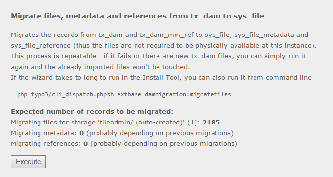
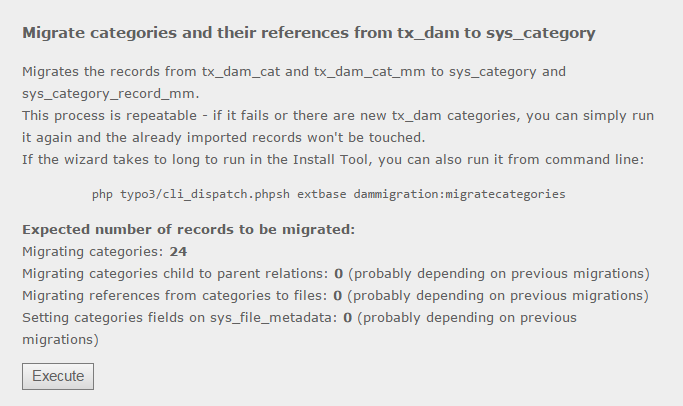

********************
DAM to FAL migration
********************

.. contents::

================
What does it do?
================
With this extension you can migrate your tx_dam files and categories to FAL files
and the new system categories. It currently handles migration of

1. Files from tx_dam to sys_file
2. File metadata from tx_dam to sys_file_metadata
3. File references from tx_dam_mm_ref to sys_file_reference
4. Media-Typo-Tags to Link-Tags via sys_refindex
5. Categories from tx_dam_cat to sys_category
6. Category references from tx_dam_mm_cat to sys_category_record_mm

The migrations are done on **database level** which means that you don't need the
associated files to exist at the installation on which you do the migration.

Furthermore all fields the **mapping configuration** is done in the extension
local configuration and can be overridden by other extensions. So if you need to add
mapping for custom fields on each of the involved tables or need to change the
default mapping, you can do this from any other extension.

As it is common that the migration needs to happen during an upgrade we've also added
an **update step for the install tool upgrade wizard** so that you can simply
to the migration from within the install tool.

============
Installation
============
If you're planning to do the migration during the update from the install tool, you
need to install the extension **before** you upgrade TYPO3 (the extension will be
installed but do nothing until the TYPO3 sources are updated).
To install, just download the Extension from TER_ or check it out from github_ and
install it via the extension manager.

.. _TER: http://typo3.org/extensions/repository/view/nr_dam_falmigration
.. _github: https://github.com/netresearch/t3x-nr_dam_falmigration

=====
Usage
=====

In the install tool
===================
nr_dam_falmigration registers two updates for the upgrade wizard in the install tool
at the position, you should execute it: Before all updates but after the **initial
database update**. If you see the latter, please execute it first as it probably will
create tables and fields that are required by the migration updates.

If there are files or categories to import from tx_dam those should show up in the
upgrade wizard and you can simply execute them:

The files update

.. Note::

    If the updates don't show up this might have two reasons: Either there are simply
    no files or categories (left) to be imported. Or the updates have already been
    executed - if you need to rerun them, delete them from the
    ``['INSTALL']['wizardDone']`` section in LocalConfiguration.php

On the command line
===================
nr_dam_falmigration provides three commands to run the migrations from command line:

Migrate files::

    php typo3/cli_dispatch.phpsh extbase dammigration:migratefiles [--storage=123] [--dryrun] [--count]

Migrate categories::

    php typo3/cli_dispatch.phpsh extbase dammigration:migratecategories [--storage=123] [--dryrun] [--count]

Migrate files and categories (shortcut for above)::

    php typo3/cli_dispatch.phpsh extbase dammigration:migrate [--storage=123] [--dryrun] [--count]

**Options** are the same for all of the above commands:

    \--storage=123
        Limit the import to a (local) storage uid

    \--dryrun
        Don't run the sql statements but print them out

    \--count
        Only count the files/categories/references etc. (see output in the install tool wizards)

====================
Technical background
====================

Mode of operation
=================
If you intend to extend this extension, some background information about the
operations might be useful:

A. File migration

    1. It's checked, if the extension 'filemetadata' is installed and if not, it will
       be installed automatically.
    2. For each local storage the **new** ``tx_dam files`` inside the storages path
       are inserted into ``sys_file``. Thereby the ``tx_dam.uid`` is written into
       ``sys_file._migrateddamuid`` - tx_dam files that were already imported
       (have a ``sys_file`` with that ``_migrateddamuid``) will **not** be imported
       again on subsequent runs.
    3. The **new** ``sys_file_metadata`` is imported from ``tx_dam`` files **present**
       in ``sys_file``. The identification happens analogical to the sys_file
       identification: Each ``sys_file_metadata`` record belongs to one sys_file
       record which belongs to one ``tx_dam`` record.
    4. The **new** ``sys_file_reference``'s are imported from ``tx_dam_mm_ref``'s of
       ``tx_dam`` files **present** in ``sys_file``. The  identification happens
       analogical to the sys_file identification: Each ``sys_file_reference`` record
       belongs to one ``sys_file`` record which belongs to one ``tx_dam`` record.
    5. All ``<media>`` tags found in the ``sys_refindex`` table will be replaced by
       their <link> tag pendants - **thus it's important that you don't update the
       refindex** until you migrated the media tags. As the tags will be replaced, this
       happens only once for each record containing fields with media tags.
    6. Related records are sanitized: With the new FAL fields, TYPO3 requires those
       fields to be present in the foreign table and contain the number of referenced
       files. The migration attempts to do this for all FAL fields on all tables.

B. Category migration

    1. All **new** ``sys_category``'s are inserted from ``tx_dam_cat``. Thereby the
       ``tx_dam_cat.uid`` is written into ``sys_category._migrateddamcatuid`` - tx_dam
       categories that were already imported (have a ``sys_category`` with that
       ``_migrateddamcatuid``) will **not** be imported again on subsequent runs.
    2. The **new** ``sys_category_record_mm``'s are imported from ``tx_dam_mm_cat``'s
       of ``tx_dam_cat``'s **present** in ``sys_category``.
       The identification happens analogical to the sys_category identification: Each
       ``sys_category_record_mm`` record belongs to one ``sys_category`` record which
       belongs to one ``tx_dam_cat`` record.
    3. Related records are sanitized: With the new category fields, TYPO3 requires
       those fields to be present in the foreign table and contain ``1``. The migration
       attempts to do this for all category fields on all tables.

Difference to dam_falmigration
==============================
There is already another extension to migrate DAM data to FAL: dam_falmigration_. It
can handle the migration of files, metadata, references, categories, collections,
tt_news-relations and selections.

Though we developed this extension because dam_falmigration desperately needs all
files to be **physically available** during migration. This is quite cumbersome if
you want to migrate huge datasets of remote installations (in our very case the files
were also moved to a cloud storage in parallel, thus we only needed to get their
metadata and relations into FAL).

Moreover we could get the migrations to work much faster than with dam_falmigration
because the data isn't fetched, processed and written by PHP but handled in single
SQL `INSERT ... SELECT`_ transactions (by that we could f.i. import about 100k of
records in like 2 minutes). This also allowed us to completely handle the
migrations as one transaction which is **automatically rolled back** whenever
something goes wrong. As we the migrations are thus **faster**, more
**resource efficient** and **reliable** we could wrap them and create an update step
for the **install tool upgrade wizard**.

However dam_falmigration_ offers some migrations that we didn't implement as we
didn't need them (yet) or because we solved them in a different way:
For operations that utilize the deprecated DAM API we've developed a `compatibility
layer`_ which also hooks into TCA and FlexForm configuration handling to rewrite
DAM to FAL relations at runtime.

.. _dam_falmigration: https://github.com/b13/t3ext-dam_falmigration/
.. _`INSERT ... SELECT`: https://dev.mysql.com/doc/refman/5.0/en/insert-select.html
.. _`compatibility layer`: https://github.com/netresearch/t3x-dam_compat

Override mapping
================
The default field mapping can be found in ``ext_localconf.php`` and you may override
it from any other extensions. Those should depend on nr_dam_falmigration in order to
be invoked in the correct order. Also they should register the mappings depending on
the TYPO3 version so that they can be installed prior to a update to TYPO3 6.2
(see ``nr_dam_falmigration/ext_localconf.php`` for an example way).

In order to override mappings, call the method ``Netresearch\NrDamFalmigration\Service\FileMigrationService::appendMappings``
from your ext_localconf.php, which takes two arguments: The target table and and an
array where the keys are the fields of the target table and the values are the source
statement. Those can contain the correctly prefixed field names, SQL statements,
variables (``:variable``) and references to the default mapping
(``:default(target_table.field)``)::

    // ext_localconf.php
    <?php
    \Netresearch\NrDamFalmigration\Service\FileMigrationService::appendMappings(
        'sys_file_metadata',
        array(
            'width' =>
                "IF (tx_dam.tx_myext_width != '', tx_dam.tx_myext_width, :default(sys_file_metadata.width))",
            'height' =>
                "IF (tx_dam.tx_myext_height != '', tx_dam.tx_myext_height, :default(sys_file_metadata.height))",
            'tx_myext_importtime' => 'UNIX_TIMESTAMP()'
        )
    );

Below you find a table listing the source tables and variables available for each target table:

+------------------------+-----------------------+--------------------------------------------------+
| Target table           | Source tables         | Variables                                        |
+========================+=======================+==================================================+
| sys_file               | tx_dam                | baseDir                                          |
|                        |                       |   Basedir of the storage (e.g. ``"fileadmin/"``) |
|                        |                       | baseDirLen                                       |
|                        |                       |   String length of the basedir                   |
|                        |                       | storageUid                                       |
|                        |                       |   Id of the storage in use                       |
+------------------------+-----------------------+--------------------------------------------------+
| sys_file_metadata      | tx_dam                | \-                                               |
|                        | sys_file              |                                                  |
+------------------------+-----------------------+--------------------------------------------------+
| sys_file_reference     | tx_dam_mm_ref mm      | \-                                               |
|                        | sys_file sf           |                                                  |
+------------------------+-----------------------+--------------------------------------------------+
| sys_category           | tx_dam_cat dc         | \-                                               |
+------------------------+-----------------------+--------------------------------------------------+
| sys_category_record_mm | tx_dam_mm_cat dcm     | \-                                               |
|                        | sys_category sc       |                                                  |
|                        | sys_file sf           |                                                  |
|                        | sys_file_metadata sfm |                                                  |
+------------------------+-----------------------+--------------------------------------------------+

.. Note::
    You can add your own variables by registering a slot to the create insert or
    create update query signals::

        // ext_localconf.php
        <?php
        $signalSlotDispatcher->connect(
            'Netresearch\\NrDamFalmigration\\Service\\AbstractMigrationService',
            Netresearch\\NrDamFalmigration\\Service\\AbstractMigrationService::CREATE_INSERT_QUERY_SIGNAL,
            'Vendor\\Package\\Service\\MyAspect',
            'createQuery'
        );

        // Classes/Service/MyAspect.php
        <?php
        namespace Vendor\Package\Service;
        class MyAspect {
            public function createQuery(Service $service, $args) {
                if ($args['to'] == 'sys_file') {
                    $args['vars']['myArg'] = 123;
                }
            }
        }

    Please see the Service/\*MigrationService classes for deeper understanding.
